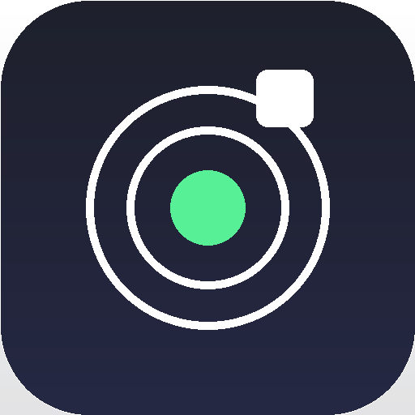

<p align="center"></p>

# ropysence

Custom Discord Rich Presence that mirrors your live Roblox status (Online /
In Game with server player count / In Studio / Offline), pushed over the
real Discord Gateway using a scoped OAuth2 grant.

**This is a self-hosted, single-user tool.** Every person who runs it
creates their own Discord application and authorizes it against their own
accounts -- there's no shared server, no shared credentials, nothing
multi-tenant. Clone it, make it yours.

## Setup

```
pip install -r requirements.txt
python run.py
```

Or install it as a command so you don't need `python run.py` every time:

```
pip install -e .
ropysence
```

1. Create a Discord app at https://discord.com/developers/applications,
   enable OAuth2 -> "Public Client", and add a redirect URI matching
   `script.localhost.port` in your config (default `http://127.0.0.1:8969/callback`).
2. Run once (`python run.py` or `ropysence`): creates `options.txt` under
   `~/.config/ropysence/` and exits so you can fill in `script.user.id`.
   `script.dev.img.default` already points at this repo's hosted `icon.png`
   by default, so there's no manual asset-upload step needed to get an
   image showing for Online/Studio/Offline.
3. Run again: prompts for your Roblox `.ROBLOSECURITY` cookie (hidden
   input, stored encrypted afterward -- never typed again), opens your
   browser for Discord authorization (also cached afterward), then
   connects and starts pushing your Roblox activity.

## Configuration -- `options.txt`

A flat `key=value` file (not JSON) at `~/.config/ropysence/options.txt`,
auto-created with full inline documentation on first run. Required fields
are grouped first.

```
script.user.id="YOUR_DISCORD_APPLICATION_ID"   # required
privacy.player.count=true
privacy.player.name.placeholder=false
privacy.anonymous=false
rpc.button.join=true
rpc.button.profile=true
rpc.button.gamepage=false
rpc.game.details="In Game ({game.server.current}/{game.server.max})"
rpc.type=0
rpc.state="online"
script.interval=5
script.dev.warn=true
script.dev.error=true
...
```

The full key reference, defaults, and comments live in the schema at
`src/core/options.py` (`OPTION_SCHEMA`) -- that's the source of truth, and
it's what generates the template file, so it can't drift out of sync with
what the code actually reads.

### Placeholders

Any `"quoted"` content field supports these, blank when not applicable to
the current state:

| Token | Meaning |
|---|---|
| `{user.name}` | Roblox username |
| `{user.display}` | Roblox display name |
| `{user.id}` | Roblox user id |
| `{game.name}` | Current game's name (only set while in a game) |
| `{game.id}` | Roblox placeId of the current game (only set while in a game) |
| `{game.instance}` | Roblox server/instance id, a.k.a. job id (only set while in a game) |
| `{game.server.current}` | Players on the matched server |
| `{game.server.min}` | Server's minimum players -- Roblox's public API rarely exposes this, often blank |
| `{game.server.max}` | Server's max players |
| `{game.subplace.name}` | Name of the specific subplace/area you're on, if the game has more than one place -- see Subplaces below |
| `{game.subplace.id}` | placeId of that subplace |
| `{custom.<name>}` | Your own placeholders -- see Custom placeholders below |

### Subplaces

Some games (theme parks, hub-and-area layouts, etc.) are made of multiple
Roblox "places" within one universe -- an overall game plus separate areas
players can teleport between. `{game.subplace.name}`/`{game.subplace.id}`
let you show which specific one you're actually on, separately from the
game's overall name:

```
rpc.game.state="{game.name} | {game.subplace.name}"
```

Blank (and the `|` just renders with nothing after it) whenever you're on
the main place, or when this can't be determined. That second case is the
common one: Roblox's places-list API is creator-facing and requires edit
access to the game, so it only works for games you personally own or
co-own -- it 403s for essentially any other game, which is expected and
handled gracefully, not an error.

### Privacy

- `privacy.player.count` -- turn off to never show live player counts, even when a public server match is found.
- `privacy.player.name.placeholder` -- when counts aren't available, whether to fall back to showing your username (`true`) or leave it blank (`false`, default).
- `privacy.anonymous` -- the strongest setting: shows only that you're in a game or online/studio, with no game name, no counts, no buttons, no avatar. The large image always becomes `script.dev.img.default` in this mode, and no extra Roblox API calls are made for game details at all.

### Buttons

Discord allows at most 2 buttons -- exactly two fully generic slots, each
just a text+url template pair:

```
rpc.button.one.text="Join Game"
rpc.button.one.url="roblox://placeId={game.id}&gameInstanceId={game.instance}"
rpc.button.two.text="{user.name}'s Profile"
rpc.button.two.url="https://www.roblox.com/users/{user.id}/profile"
```

A button is shown only if **both** its text and url fully resolve -- no
missing placeholder. That's the whole mechanism behind the default Join
button only appearing while actually in a game: its URL needs `{game.id}`/
`{game.instance}`, which simply don't exist otherwise, so it's hidden
rather than shown broken. This applies equally to whatever you reconfigure
either slot to -- there's no special-cased "this is the join button" logic
anywhere anymore. Set either slot to anything: a Discord invite, your
website, a donation link, another game entirely.

### Custom placeholders

Define as many as you want, named anything:

```
placeholder.my.website="example.com"
placeholder.join.url="https://discord.gg/{custom.my.website}"
```

Reference them anywhere with the `custom.` prefix (added automatically so
they can never collide with the built-in placeholder names):

```
rpc.button.two.url="https://{custom.my.website}/{user.name}"
```

Custom placeholder values can reference other placeholders, including
other custom ones, in any declaration order -- `join.url` above referencing
`my.website` before or after its own line both work. One limitation: a
custom placeholder's own definition can only reference your Roblox user
info (`{user.name}`/`{user.display}`/`{user.id}`) and other custom
placeholders, not per-game dynamic tokens like `{game.name}` -- but a
button template can still reference those *directly* just fine, so this
only matters if a custom placeholder specifically tries to embed
`{game.name}` itself.

### Images

Discord's Activity API can't reference a local file path directly. Two
ways to specify `script.dev.img.default` (the fallback shown for Online/
Studio/Offline/anonymous-mode):

- **A URL** (the default -- this repo's hosted `icon.png`): proxied
  automatically through Discord's `POST /applications/{id}/external-assets`
  endpoint every poll, exactly the same mechanism used for the real Roblox
  game thumbnails and your avatar. Zero setup required.
- **A bare string** (e.g. `icon`): treated as a literal Rich Presence **Art
  Asset** key, which requires manually uploading an image under that exact
  name in your Discord app's dev portal first. Referencing a key that
  doesn't actually exist there appears to make Discord silently drop the
  *entire* activity update, not just that image -- if you go this route and
  Online/Studio/Offline stop showing up entirely, that manual upload step
  is the first thing to check.

Leave `script.dev.img.default` blank to omit the image entirely instead.

### Human notifications (readable status updates)

Separate from the dev log webhook below -- `human.discord.webhook` sends
one short, plain-language message per *genuine* status change (going
online, offline, starting Studio, starting a game), never a batch of raw
logs. Nothing sends if the state hasn't actually changed since the last
poll, so it stays low-volume by design.

```
human.discord.webhook=["https://discord.com/api/webhooks/..."]
human.message.ingame="{user.display} started playing {game.name}."
```

Message text for each state is fully templatable (`human.message.offline`,
`.online`, `.studio`, `.ingame`, `.ingame.anonymous`), same `{token}`
placeholders as everywhere else. `human.message.ingame.anonymous` is used
instead of `human.message.ingame` when `privacy.anonymous` is on, and
deliberately has no `{game.name}` -- the point of anonymous mode is that
the game never leaks, including here.

### Dev / logging

- `script.dev.debug` / `.info` / `.warn` / `.error` -- independent on/off
  switches per log level (not a single minimum threshold), shown as
  `DBG`/`INF`/`WRN`/`ERR` in the console.
- `script.dev.discord.webhook` -- the technical firehose: raw log lines
  (respecting the same level toggles), batched and flushed every
  `script.dev.discord.webhook.interval` seconds. This is the noisy one --
  see Human notifications above for the readable alternative. Keep them
  pointed at different channels unless you actually want both mixed
  together.
- `script.dev.alias` -- used as the Gateway client name and both webhooks'
  message username.

### Multiple webhook URLs

Both `human.discord.webhook` and `script.dev.discord.webhook` accept a
JSON array of URLs instead of a single one:

```
script.dev.discord.webhook=["https://discord.com/api/webhooks/a","https://discord.com/api/webhooks/b"]
```

Messages/chunks are round-robined across all configured URLs and sent
concurrently (small thread pool per webhook channel) -- spreads load
across endpoints so no single webhook eats all your rate-limit budget, and
cuts total delivery latency when there's more than one chunk to send. A
single bare or quoted URL still works too, unchanged.

### Reconnect

If the Gateway connection drops -- network blip, Discord-issued
`RECONNECT`, `INVALID_SESSION`, or any abnormal close -- it's retried
automatically with exponential backoff instead of the process just exiting.
When the prior session is still valid, it uses Discord's `RESUME` protocol
(faster, no re-authorization) rather than a full re-`IDENTIFY`.

```
script.reconnect.enabled=true
script.reconnect.base_delay=5      # seconds before the first retry
script.reconnect.max_delay=300     # cap on the backoff delay
script.reconnect.max_attempts=0    # 0 = retry forever
```

A successful reconnect resets the backoff back to `base_delay` -- a
connection that stayed up for hours before dropping isn't penalized with a
long wait on its next retry. Ctrl+C always stops the process; it never
triggers a reconnect attempt.

## Project structure

```
ropysence/
├── icon.png              project icon / default Rich Presence image source
├── run.py                entry point -- `python run.py`
├── requirements.txt
├── src/
│   └── ropysence/           the actual importable package (src/ itself is
│       │                    just a container -- standard "src layout",
│       │                    keeps the package name unique so it can't
│       │                    collide with an unrelated "src" from anyone
│       │                    else's project on the same machine)
│       ├── app.py             orchestration: wires everything together
│       ├── core/               shared foundation
│       │   ├── options.py        options.txt schema, parser, template generator
│       │   ├── secure_store.py   encrypted local storage (keyring / key file)
│       │   ├── templating.py     {token} substitution engine
│       │   ├── logging_setup.py  INF/WRN/ERR/DBG config, per-level toggles
│       │   └── webhook_logger.py batched Discord webhook log handler
│       ├── discord/             Discord side
│       │   ├── oauth.py           PKCE OAuth2 flow + cached token refresh
│       │   ├── gateway.py         Gateway connection, heartbeat, presence push
│       │   └── assets.py          external-assets image proxy
│       ├── roblox/               Roblox side
│       │   ├── client.py          API calls (auth, presence, games, servers)
│       │   └── presence_builder.py Roblox presence -> Discord activity dict
│       └── workers/             concurrency utilities (available for future use)
│           ├── pool.py            ThreadPoolExecutor wrapper
│           └── timing.py          timing decorator for worker tasks
├── tools/
│   └── diagnose_presence.py  fast standalone presence check (see below)
└── build/
    ├── build.py               PyInstaller packaging script
    ├── requirements.txt       build-only deps, kept out of the main install
    └── README.md
```

Note on concurrency: `build_activity()` runs synchronously and is offloaded
as a whole to a worker thread once per poll cycle (see `discord/gateway.py`)
rather than parallelizing its individual Roblox calls internally -- this
mirrors the version that was actually confirmed working end-to-end against
the real Gateway. `workers/pool.py` is kept available for whoever wants to
reintroduce finer-grained parallelism later.

## Debugging "it always says Offline"

Run `python tools/diagnose_presence.py` (or `--watch` to poll every 5s)
while you're actually in a game. It talks to Roblox only, skips Discord/
OAuth entirely, and prints the raw JSON `presence.roblox.com` returns for
your account -- that's the ground truth to compare against. Full request/
response bodies are also logged at `DBG` in normal runs (never the cookie
itself).

## Where your secrets live

`~/.config/ropysence/`
- `options.txt` -- your settings and text templates (not sensitive)
- `store.enc` -- your Roblox cookie + Discord tokens, encrypted (Fernet)
- `secret.key` -- the encryption key, only if no OS keyring backend was
  available (chmod 600). If `keyring` is installed and a backend exists,
  the key lives in your OS keychain instead and this file won't exist.

To reset either credential, delete `store.enc` (or use
`SecureStore().delete("roblox_cookie")` / `.delete("discord_tokens")` from
a Python shell) and rerun.

## Security notes

- Your Roblox `.ROBLOSECURITY` cookie is a full account credential --
  equivalent to your password. It's encrypted at rest, but that protects
  against casual exposure (accidental sharing, a stray screenshot, a git
  commit) rather than a fully compromised machine. Never paste it anywhere
  else. If you suspect it leaked, log out all sessions in Roblox account
  settings immediately.
- If you start seeing `WRN ... hit Roblox rate limit (HTTP 429)` in the
  logs, raise `script.interval` in `options.txt`.
